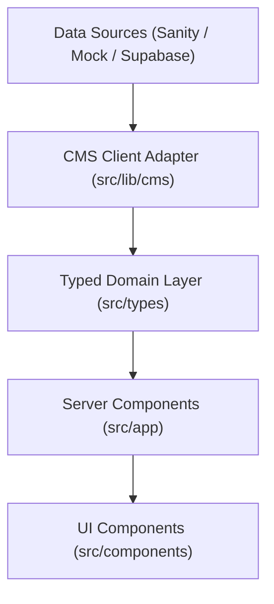

# Reset Men Salon — Technical Architecture & System Design

## 1. Executive Summary & Project Purpose
**Reset Men Salon** is Dubai's premier luxury men's grooming destination located in Business Bay, Dubai. This architecture blueprint establishes the production-grade, headless-ready foundation for the digital presence at [resetmensalon.ae](https://resetmensalon.ae/).

The architecture is designed with high standards of:
- **Performance**: Sub-second TTFB, 95+ Core Web Vitals, server-rendered components by default.
- **Scalability**: Decoupled CMS data layer allowing painless swap between local typed datasets and Headless CMS engines (Sanity, Contentful, Strapi).
- **Aesthetic Rigor**: Bespoke dark luxury editorial design tokens with curated typography, micro-interactions, and smooth scrolling.
- **Local SEO Superiority**: Deep JSON-LD schema graphs targeting high-value grooming queries across Dubai and the UAE.
- **Maintainability**: Strict TypeScript contracts, modular component hierarchy, and zero tightly coupled UI spaghetti.

---

## 2. Technology Stack

| Layer | Technology | Rationale |
|---|---|---|
| **Framework** | Next.js 15+ (App Router) | React Server Components (RSC), optimized routing, built-in dynamic SEO, streaming SSR |
| **Language** | TypeScript (Strict) | Compile-time type safety across domain models, CMS schemas, and props |
| **Styling** | Tailwind CSS v3/v4 | Utility-first CSS with bespoke luxury design tokens, zero CSS runtime overhead |
| **Motion / Micro-UI** | Framer Motion (Motion) | Declarative entrance animations, page transitions, responsive gestures |
| **Advanced Scroll** | GSAP 3 & `@gsap/react` | High-performance pin-scrolling, hero parallax, and non-blocking timelines |
| **Smooth Scroll** | Lenis | Hardware-accelerated smooth scrolling with built-in accessibility fallbacks |
| **Icons** | Lucide React | Lightweight, tree-shakable SVG iconography |
| **Validation** | Zod | Runtime schema validation for forms, APIs, and environment variables |
| **Testing** | Vitest & React Testing Library | Blazing fast unit and component integration testing |
| **Tooling** | ESLint + Prettier | Automated code formatting and style consistency |

---

## 3. Directory Topology

```text
reset-men-salon/
├── docs/                     # Comprehensive engineering & architectural guides
├── public/                   # Static assets (optimized images, icons, brand marks)
├── src/
│   ├── app/                  # Next.js App Router route hierarchy
│   │   ├── (routes)/         # Logical route grouping (about, services, pricing, blog, contact)
│   │   ├── api/              # Secure REST route handlers
│   │   ├── layout.tsx        # Master root layout with global providers
│   │   ├── sitemap.ts        # Dynamic XML sitemap generator
│   │   └── robots.ts         # Robots.txt policy generator
│   ├── components/
│   │   ├── ui/               # Reusable headless/styled design system primitives
│   │   ├── sections/         # Composed page sections
│   │   ├── animation/        # Motion wrappers, smooth scroll providers
│   │   └── layout/           # Header, footer, mobile navigation, drawers
│   ├── config/               # Static configurations (site metadata, navigation, theme)
│   ├── data/                 # CMS-ready mock datasets and fallback fixtures
│   ├── hooks/                # Custom React hooks (lenis, motion, reduced-motion, media)
│   ├── lib/                  # Utilities, CMS client adapters, SEO schemas, security
│   ├── styles/               # Global CSS, CSS variables, typography imports
│   └── types/                # Pure TypeScript domain & CMS data definitions
├── tests/                    # Unit, integration, and E2E test suites
├── scripts/                  # DevOps, seeding, and verification scripts
└── ARCHITECTURE.md           # Master root link to architecture documentation
```

---

## 4. Page Routing Architecture

| Route Path | Type | Cache Strategy | Purpose |
|---|---|---|---|
| `/` | Server Component | ISR (Revalidate 3600s) | Luxury hero, signature services overview, brand story, testimonials, quick booking |
| `/about` | Server Component | Static / ISR | Heritage, master barbers, craftsmanship, salon interior |
| `/services` | Server Component | Static / ISR | Master service taxonomy overview (7 categories) |
| `/services/[category]` | Server Component | Dynamic ISR | Category deep dive (e.g. `japanese-head-spa`, `hair-and-beard`) |
| `/services/[category]/[slug]` | Server Component | Dynamic ISR | Individual service page with rich pricing, duration, and FAQ |
| `/pricing` | Server Component | Static / ISR | Transparent luxury pricing menu, curated packages, VIP memberships |
| `/blog` | Server Component | ISR (Revalidate 600s) | Grooming journal, hair care guides, styling editorial |
| `/blog/[slug]` | Server Component | Dynamic ISR | Full article with Article Schema, reading time, author card |
| `/contact` | Server Component | Static | Interactive location card, Business Bay map, WhatsApp concierge, inquiry form |

---

## 5. CMS & Data Architecture



The application strictly separates data retrieval from presentation via an abstract CMS Client interface (`CmsClient`):
- `getServices()`: Fetches all services with nested category mappings
- `getServiceBySlug(slug)`: Retrieves detailed service metadata and FAQs
- `getPricingPackages()`: Fetches tiered pricing packages
- `getBlogPosts()`: Fetches paginated editorial posts
- `getSiteSettings()`: Fetches dynamic contact details, operating hours, and banner notices

---

## 6. SEO & Local Discovery Architecture
1. **JSON-LD Schema Graph**:
   - `HairSalon` / `LocalBusiness`: Address (Business Bay, Dubai), Geo Coordinates, Phone (+971 4 565 5688), Opening Hours, Price Range (`$$$`).
   - `Service`: Structured service pricing, provider, and duration.
   - `Article`: Editorial schema with author attribution and publisher metadata.
   - `BreadcrumbList`: Structured path navigation hierarchy.
2. **Metadata API**: Every page exports dynamic or static `Metadata` adhering to OpenGraph standards, canonical tags, and localized English (`en_AE`).

---

## 7. Animation Architecture
- **Layer 1 (Declarative Transitions)**: `framer-motion` for container staggers, text reveals, and subtle hover reactions.
- **Layer 2 (Smooth Physics)**: `lenis` for hardware-accelerated momentum scrolling.
- **Layer 3 (Cinematic Parallax & Pinned Stages)**: `gsap` with `ScrollTrigger` for luxury visual showcases.
- **Accessibility**: Automatic fallback to instant state transitions whenever `prefers-reduced-motion: reduce` is active.

---

## 8. Security & Performance Strategy
- **Security Headers**: HSTS, CSP, X-Frame-Options (`SAMEORIGIN`), X-Content-Type-Options (`nosniff`), Permissions-Policy.
- **Validation**: All incoming API requests and form submissions validated against strict Zod schemas.
- **Rate Limiting**: IP-based rate limiting on sensitive contact and booking endpoints.
- **Font & Asset Optimization**: Next/Font with zero layout shift (CLS: 0), AVIF/WebP image pipelines.

---

## 9. Naming & Coding Conventions
- **Files**: `kebab-case.tsx` / `kebab-case.ts`
- **React Components**: `PascalCase`
- **Hooks**: `useCamelCase`
- **Constants**: `SCREAMING_SNAKE_CASE`
- **Types/Interfaces**: `PascalCase` prefixed or descriptive noun phrases (e.g. `ServiceItem`, `PricingTier`)
